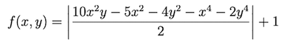

# Artificial Intelligence Basics

My solutions to the assignments given during the AI course of UniTBv. This repository includes implementations of:

- A [linear regression](./2020.03.05/Lab_2.ipynb) on the [UCI CBM dataset](http://archive.ics.uci.edu/ml/datasets/condition+based+maintenance+of+naval+propulsion+plants)
- [Binary](./2020.03.17/logreg_2classes.ipynb) and [multi-class](./2020.03.17/logreg_k_classes.ipynb) logistic regressions on the [MNIST dataset](https://en.wikipedia.org/wiki/MNIST_database)*
- A [multilayer perceptron](./2020.05.03/MLP_Sirbu_Matei_Dan_10LF383.ipynb), trained on the [MNIST dataset](https://en.wikipedia.org/wiki/MNIST_database)*
- A [genetic algorithm](./2020.06.02/GA_Sirbu_Matei_Dan_10LF383.ipynb) that computes the local maximum of:   

\* Place `mnist_train.csv` and `mnist_test.csv` (included in `MNIST.zip`) inside `./data` prior to the Jupyter Notebook execution.

The outstanding course documentation provided by [Lucian M. Sasu, Ph.D.](https://github.com/lmsasu) can be found [here](./Documentation/InteligentaArtificiala.pdf).